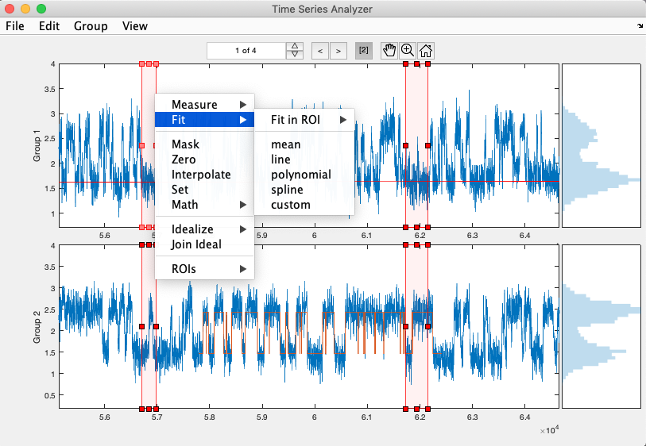

# TimeSeriesAnalyzer
Flexible and performant viewer and analysis tool for groups of time series.

* Flexible grouping of multiple time series (e.g. recordings in multiple channels).
* Fast plotting of HUGE time series (requires Jim Hokanson's [plotBig_Matlab](https://github.com/JimHokanson/plotBig_Matlab)).
* Overlay each time series with any number of associated time series (e.g. idealization, fit, etc.)
    * A simple naming scheme allows the user to add an arbitrary number of these signals to the data.
* Dynamic selection of groups/data to visualize and traversal across time series within each group.
* Click and drag selection of x-axis range ROIs for analysis of subsections of time series.
    * !!! When active, all operations below will be restricted to selected subsections.
    * Functionality supplied by `XAxisROIManager` which can also be used standalone with any plot axes.
* Measure signal properties.
* Curve fitting.
* Mask, zero, interpolate, or apply basic mathematical operations.
* Simple idealization of piecewise continuous signals.
* Import other time series data files (e.g. HEKA).
* Simple, flexible and easily extended underlying `struct array` data structure.
* Entire UI is in a single `uipanel` and is easily reparented into your own custom UI.

---
## Basic Usage
    % This will create a new figure and put the UI panel in it.
    obj = TimeSeriesAnalyzer();
    
    % Supply some data in one of the following forms:
    % - a compatible struct array (see description of Data below)
    % - [x y] or [y] data array
    % - cell array of [x y] or [y] data arrays
    obj.setData(...);
    
    % Alternatively, you can load a previously saved Data struct array from file
    % or import a supported data file (e.g. HEKA).
    % These commands are also in the File menu.
    obj.loadData('path/to/file');
    obj.importHEKA('path/to/file');

---
## Install
Just make sure `TimeSeriesAnalyzer.m` and `XAxisROIManager.m` are in your MATLAB path.

---
## Data structure

---
## Supported file formats

---
## Groups

---
## Sweeps

---
## Associated Time Series (e.g. idealization, fit, etc.)

---
## XAxisROIManager

---
## Measurement

---
## Curve Fitting

---
## Data Operations

---
## Idealization of piecewise continuous signals

---
## Incorporation into your own UI

---
## To Do

* Make available as MATLAB Add-On
* Join Idealization
* Gaussian Filter
* Import Axon, Axograph
