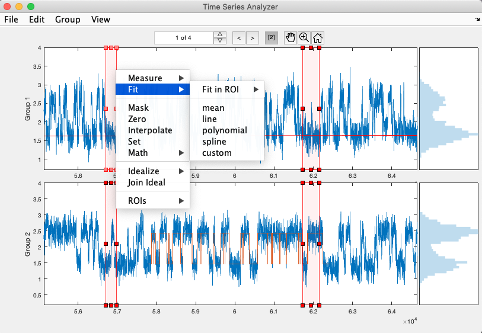
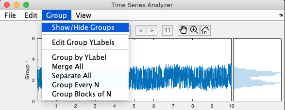
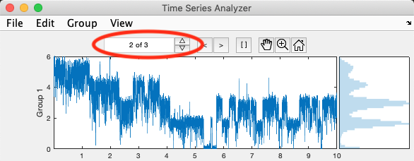
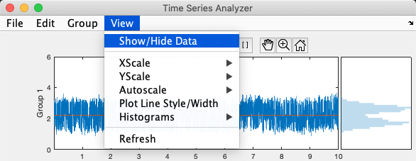
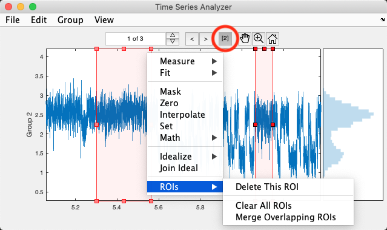
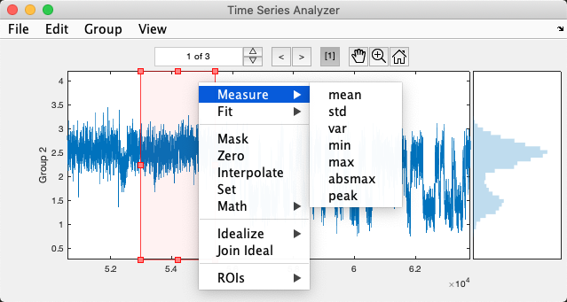
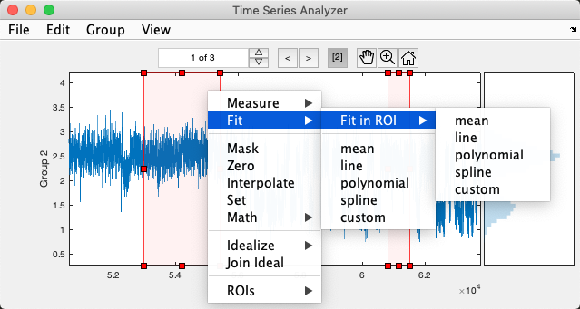
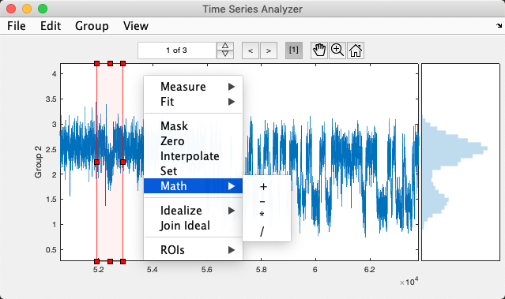
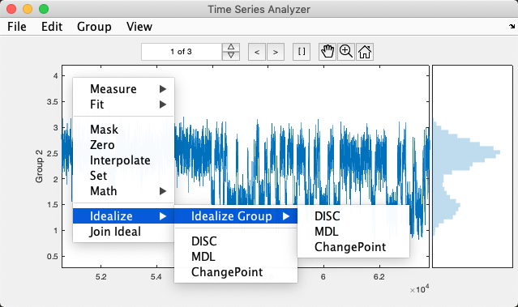

# TimeSeriesAnalyzer
Flexible and performant viewer and analysis tool for groups of time series.

* Flexible grouping of multiple time series (e.g. recordings in multiple channels).
* Fast plotting of HUGE time series (requires Jim Hokanson's [plotBig_Matlab](https://github.com/JimHokanson/plotBig_Matlab)).
* Overlay each time series with any number of associated time series (e.g. idealization, fit, etc.)
    * A simple naming scheme allows the user to add an arbitrary number of these signals to the data.
* Dynamic selection of groups/data to visualize and traversal across time series within each group.
* Click and drag selection of x-axis range ROIs for analysis of subsections of time series.
    * !!! When active, all operations below will be restricted to selected subsections.
    * Functionality supplied by `XAxisROIManager` which can also be used standalone with any plot axes.
* Measure signal properties.
* Curve fitting.
* Mask, zero, interpolate, or apply basic mathematical operations.
* Simple idealization of piecewise continuous signals.
* Import other time series data files (e.g. HEKA).
* Simple, flexible and easily extended underlying `struct array` data structure.
* Entire UI is in a single `uipanel` and is easily reparented into your own custom UI.



## Basic Usage
```Matlab
% This will create a new figure and put the UI panel in it.
obj = TimeSeriesAnalyzer();

% Supply some data in one of the following forms:
% - a compatible struct array (see description of Data below)
% - [x y] or [y] data array
% - cell array of [x y] or [y] data arrays
obj.setData(...);

% Alternatively, you can load a previously saved Data struct array from file
% or import a supported data file (e.g. HEKA).
% These commands are also in the UI's File menu.
obj.loadData('path/to/file');
obj.importHEKA('path/to/file');
```

## Install
Just make sure `TimeSeriesAnalyzer.m` and `XAxisROIManager.m` are in your MATLAB path.

## Data structure
The Data property of the `TimeSeriesAnalyzer` class is a struct array where each struct in the array contains all of the associated data for a time series.

The time series (x,y) data:

    Data.xdata
    Data.ydata

Axis labels (units should be included within the labels, e.g. "Time, sec"):

    Data.xlabel
    Data.ylabel

Associated time series such as idealizations, fits, etc. For compatibility with the viewer the (x,y) data for these signals should have fieldnames with the format `xNAME` and `yNAME`, where `NAME` can be any valid fieldname other than `data` (e.g. `MyData` --> `Data.yMyData`). If `xNAME` does not exist or is empty, it defaults to `xdata`. The UI's View menu allows dynamic selection by `NAME` of which signals to view.

    Data.xNAME
    Data.yNAME

!!! Note, the UI treats the following `NAME`s specially, and they should be avoided for anything other than their intended use:

    Data.yraw   --> Original unmodified copy of Data.ydata
    Data.yideal --> Idealization of Data.ydata
    Data.yfit   --> Result of curve fit to Data.ydata

## Command Window access to UI and Data
```Matlab
 % Store a handle to the UI instance for access to everything in the UI
 obj = TimeSeriesAnalyzer();

 % Set the xlabel of the 2nd time series
 obj.Data(2).xlabel = "Time, s";

 % Set the xlabel for all time series
 [obj.Data.xlabel] = deal("Time, s");

 % Update all of the plots in the UI (e.g. if displayed data changes)
 obj.replot();

 % Refresh the UI (e.g. if displayed groups/axes change)
 obj.refresh();
 ```

## Supported file formats
* HEKA binary data files

## Groups
Time series structs in `Data` are grouped according to the field `Data.group`. Each group is displayed in its own axes which are arranged vertically in the UI. The x-axis limits for all group axes are linked to maintain their temporal alignment when zoomed. The user can dynamically select a subset of groups to display in the UI (see the Group menu). The group label is the `ylabel` of the first time series in the group. Setting the group label sets the `ylabel` of all time series in the group.



```Matlab
 % !!! Typically you will not call the functions below directly,
 %     but use the UI's Group menu to assign groups and group labels.

 % Split six time series into three groups
 setGroups([1,2,3,1,2,3]);
 setGroups([1,2,3]); % does the same as above

 % Query the current group indices
 ind = groups(); % ind = [1,2,3,1,2,3]

 % Set the ylabel of all time series in each group
 setGroupLabels(["Current, pA", "Voltage, mV", "Temperature, C"]);

 % Query the group labels
 labels = groupLabels(); % labels = ["Current, pA", "Voltage, mV", "Temperature, C"]

 % Only show the 1st and 3rd group (Current and Temperature) in the UI
 setVisibleGroups([1,3]);

 % Query which groups are visible in the UI
 ind = visibleGroups(); % ind = [1,3]
 ```

## Sweeps
Each time series within a group is referred to as a sweep. The spinbox in the UI above the plots allows specifying which sweeps are visible and traversal across the sweeps.



```Matlab
 % !!! Typically you will not call the functions below directly,
 %     but instead use the sweeps spinbox in the UI above the plots.

 % Show only the 2nd and 4th time series within each group
 setVisibleSweeps([2,4]);

 % Query which sweeps are visible in the UI
 ind = visibleSweeps(); % ind = [2,4]
 ```

## Associated yNAME Signals
Multiple associated signals as defined by all `Data.yNAME` fields can be simultaneously displayed for each sweep. The signals are automatically assigned unique colors according to their index into the array of all signal names returned by `names()`. Signals that are either `cfit` objects, `ppform structs`, or idealizations (i.e. piecewise continuous without noise) are by default shown with a thicker linewidth (see `replot()`).



```Matlab
 % !!! Typically you will not call the functions below directly,
 %     but instead use the UI's View menu to select which data to show.

 % For Data with fields ydata, yraw, yideal, yfit and yspecial:
 strs = names(); % strs = ["raw","data","ideal","fit","special"]

 % Only show Data.ydata and Data.yideal in the UI
 setVisibleNames(["data","ideal"]);

 % Query visible signals
 names = visibleNames(); % names = ["data","ideal"]
 ```

## XAxisROIManager
The `[]` toggle button in the UI above the plots defines whether ROIs are active/enabled. While active, left-click and drag in the plot axes to draw an ROI, and current ROIs can be moved/resized interactively as well. By default drawing a new ROI removes all prior ROIs. To draw multiple ROIs hold the shift key while drawing new ROIs (or draw using a middle-click). Deactivating ROIs via the toggle button will hide them, but not remove them. It doesn't matter which axes you draw an ROI in, it will be automatically propogated to all group axes (i.e. the ROIs are shared across groups). While active, additional menu options are available in the axes context menu, some of which depend on whether the menu was created by right-clicking inside or outside of an ROI. The toggle button also displays the current number of ROIs, e.g. `[3]`.



The `XAxisROIManager` class can also be used separately with any plot axes. However, some behavior like shift-click to draw multiple is only defined in the `TimeSeriesAnalyzer` class. By default, you always draw multiple, and must explicitly delete ROIs via their context menu.

```Matlab
xmgr = XAxisROIManager();

% Assign a list of plot axes across which ROIs should be managed and shared
xmgr.Axes = [gca someOtherAxesHandle];

% Click and drag to draw a ROI in the current axes.
% It will automatically be copied to all other managed axes.
xmgr.addROI();

% Drag to draw a ROI in the current axes with one edge at x0.
% It will automatically be copied to all other managed axes.
xmgr.addROI(x0);

% Programatically add an ROI with limits [xmin xmax]
xmgr.addROI([xmin xmax]);

% Get all ROI limits as an Mx2 matrix of [xmin xmax] for each of M ROIs
xlims = xmgr.XLims;

% Programatically set all ROIs
xmgr.XLims = [...]; % input Mx2 matrix of [xmin xmax] for each of M ROIs
```

## Measurement
Right-click in an axes for a context menu containing commands to measure properties of all displayed signals in that axes. If ROIs are active, report a separate measurement for each ROI, otherwise report a single measurement for each signal. The result is stored as a table in the `Measurement` property and also printed in the command window.



## Curve Fitting
Right-click in an axes for a context menu containing commands to fit all displayed `ydata` signals in that axes. If ROIs are active, the fit error only consideres data within the ROIs, although the fit is still shown for the entire signal. Optionally, you can restrict the fit to be within a single ROI. The result is stored in `Data.xfit` and `Data.yfit`, which will be overwritten each time. To store multiple fits, the `xfit` and `yfit` fields will need to be copied to new `xNAME` and `yNAME` fields inbetween each fit.



Right-click on a fit line object for a context menu where you can delete the fit or use it to baseline or normalize the associated `ydata`.

## Data Operations
Right-click in an axes for a context menu containing commands to mask, zero, interpolate or apply math operations to all displayed signals in that axes. If ROIs are active, only apply the operation within each ROI, otherwise apply it to the entire signal.



## Idealization of piecewise continuous signals

* Changepoint (MATLAB's findchangepts)
* DISC (requires [DISC](https://github.com/ChandaLab/DISC))
* MDL (requires [Scan_for_breaks](https://www.mathworks.com/matlabcentral/fileexchange/60224-scan_for_breaks?s_tid=prof_contriblnk) by Jacob Dreyer)



## Incorporation into your own UI
```Matlab
 % Create the UI panel as a child of a parent graphics object.
 obj = TimeSeriesAnalyzer(parent);

 % Reparent the UI panel into a new parent graphics object.
 obj.Parent = parent;
 ```

## To Do

* Make available as MATLAB Add-On
* Revert to raw function
* Join Idealization
* Gaussian Filter
* Save fit with unique name so it is not overwritten by subsequent fit
* Import Axon, Axograph
